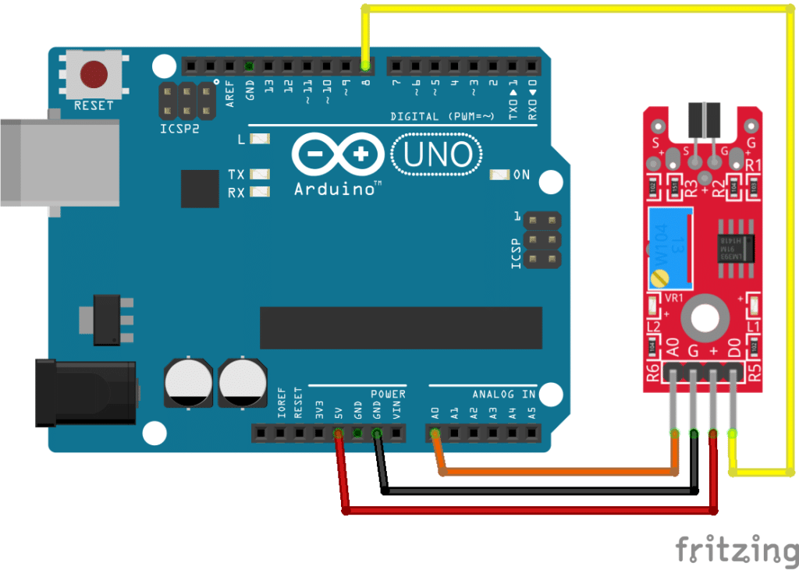
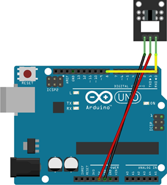
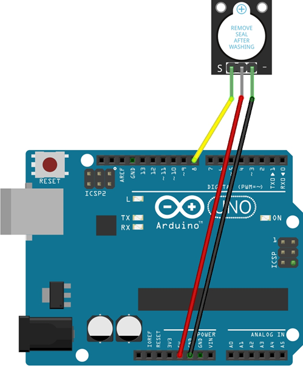

# HOPE Sensor Bridge Project

## 1. 프로젝트 개요
    - 팀명: HOPE
    - 팀원: 김환, 박창민
    - Arduino 보드: Arduino Uno
    - ROS 2 환경: ROS 2 Humble / TurtleBot3 Raspberry Pi 4
    - 통신 방식: USB Serial
    - Baudrate: 115200

## 2. 팀원
| 이름 | 역할 | 담당 작업 |
|---|---|---|
| 김환 | Arduino / 하드웨어 | 센서 배선, Arduino 펌웨어, 패킷 송수신 |
| 박창민 | ROS 2 / 문서 | ROS 2 브릿지 노드, 토픽 설계, README 정리 |

## 3. 선택한 센서 및 출력 모듈

| 번호 | 모듈 이름 | 구분 | 용도 |
|---:|---|---|---|
| 1 | 포토 인터럽터 | 입력 센서 |  |
| 2 | 터치 센서 모듈 | 입력 센서 |  |
| 3 | 부저 모듈 | 출력 모듈 |  |

## 4. 전체 시스템 구조

### 추후 작성

## 5. 센서 모듈 조사 내용

### 5.1 터치 센서 모듈

[터치 센서 모듈 image]()

| 항목 | 내용 |
|---|---|
| 구분 | 입력 센서 |
| 동작 전압 | 5V |
| 출력 방식 | Digital |
| 핀 구조 | VCC, GND, AO, DO |
| 주요 부품 | 터치 센서 |
| Arduino 연결 | AO → A0, DO -> D8 |
| 주의사항 | DO는 가변저항 기준값에 따라 HIGH/LOW 출력 |

### 5.2 포토 인터럽터

[포토 인터럽터 image]()

| 항목 | 내용 |
|---|---|
| 구분 | 입력 센서 |
| 동작 전압 | 5V |
| 출력 방식 | Digital |
| 핀 구조 | S, GND, VCC |
| Arduino 연결 | S → D7 |
| 주의사항 | 물체가 있을때 LOW, 없으면 HIGH |

### 5.3 부저 모듈

[부저 모듈 image]()

| 항목 | 내용 |
|---|---|
| 구분 | 출력 모듈 |
| 동작 전압 | 5V |
| 입력 방식 | Digital |
| 핀 구조 | VCC, GND, S |
| Arduino 연결 | S → D12 |
| 주의사항 |  |

## 6. 하드웨어 구조 및 회로 연결

### 6.1 터치센서


### 6.2 포토 인터럽터


### 6.3 부저 모듈


## 7. 배선 연결표

### 주의사항
    - 전원 연결 상태에서 회로 수정 금지: 선이 한 가닥만 잘못 꽂혀도 쇼트(단락)가 발생해 보드가 고장 날 수 있습니다. 반드시 USB 케이블이나 배터리를 분리한 상태에서 회로를 수정하고, 검수가 끝난 뒤 전원을 넣으세요.
    -  VCC와 GND 쇼트 주의: 전원(VCC/5V/3.3V)선과 그라운드(GND)선이 직접 닿으면 순식간에 과전류가 흘러 아두이노가 망가질 수 있습니다. 두 선이 이웃해서 쇼트가 나지 않도록 주의하세요.

| 모듈 | VCC | GND | Signal | Arduino Pin |
|---|---|---|---|---|
| 터치 센서 모듈 | 5V | GND | AO, DO | A0, D8 |
| 포토 인터럽터 | 5V | GND | S | D7 |
| IR 적외선 모듈 | 5V | GND | S | PWM13 |
| 부저 모듈 | 5V | GND | S | D12 |

## 8. 통신 프로토콜 설계

### 터치 센서
```yaml
packetID: 0x41
length: 1
Payload: touch_state

0x00 = touch OFF
0x01 = touch ON

touch On: AA AA AA 41 01 01 01 ~ AA EE
touch Off: AA AA AA 41 01 01 00 ~ AA EE
```
---

### 포토 인터럽트
```yaml
packetID: 0x42
length: 1
Payload: photo_state

0x00 = photo OFF
0x01 = phtho ON

```

---

### 부저 맬로디
```yaml
packetID: 0x43
length: 1
Payload: melody_state

0x00 = melody OFF
0x01 = melody ON
```


### 부저
```yaml
packetID: 0x44
length: 1
Payload: buzzer_state

0x00 = buzzer OFF
0x01 = buzzer ON

```

## 9. Packet ID 정의

|Packet ID|방향|설명|
|---:|---|---|
|0x31|Arduino → ROS2|터치센서모듈 상태, 포토인터럽터 상태, 부저모듈 상태 보고|
|0x41|ROS2 → Arduino| 터치센서모듈 -> 경유점주행 시작 |
|0x42|ROS2 → Arduino| 포토인터럽터 -> 부저소리 |
|0x43|ROS2 → Arduino| bringup -> 부저멜로디 출력 |
|0x44|ROS2 → Arduino| 부저음 출력 |
|0x7F|양방향|통신 확인용 Ping|

|Payload index|이름|크기|값|
|---:|---|---|---|
|0|touchsensor_state| 1byte | 1: on, 0: off|
|1|photesensor_state| 1byte | 1: on, 0: off|
|2|buzzer_melody_state| 1byte | 1: on, 0: off|
|3|buzzer_state| 1byte | 1: on, 0: off|

## 10. ROS 2 토픽 설계

|기능|topic name|interface|
|---|---|---|
|터치센서모듈 | /touch_sensor/state, /touch_sensor/cmd | /std_msgs/bool |
|포토인터럽터 | /photo_interrupter_sensor/state, /photo_interrupter_sensor/cmd  | /std_msgs/bool |
|부저 멜로디 | /buzzer/melody/state, /buzzer/melody/cmd | /std_msgs/bool |
|부저| /buzzer/state, /buzzer/cmd | /std_msgs/bool |


## 11. Arduino Firmware 구조
## 12. ROS 2 Sensor Bridge Node 구조

## 13. 빌드 방법

### 13.1 워크스페이스 이동

```bash
cd ~/turtlebot3_ws
```
8.2 패키지 빌드

```bash
colcon build --packages-select tb3_arduino_sensor_bridge
```
8.3 환경 설정
```bash
source install/setup.bash
```

`package.xml`에는 아래 항목이 반드시 있어야 합니다.

```xml
<export>
  <build_type>ament_cmake</build_type>
</export>
```

## 14. 실행 방법

### 14.1 Arduino 연결 확인

```bash
ls -al /dev | grep ttyACM
심볼릭 링크로 연결된 tb3_sensor 를 확인합니다. 
```

### 14.2 시리얼 권한 확인 / 설정

```bash
sudo usermod -aG dialout $USER
```

### 14.3 ros2 node 실행

```bash
ros2 run tb3_arduino_sensor_bridge arduino_sensor_bridge_project
```


## 15. 테스트 방법

| 테스트 항목 | 확인 내용 | 통과 기준 |
|---|---|---|
| 센서 단독 테스트 | Arduino에서 센서값 확인 | 값이 정상적으로 변화 |
| 배선 테스트 | VCC/GND/Signal 확인 | 센서 오동작 없음 |
| 패킷 송신 테스트 | Arduino Serial.write 확인 | Start/End/Length 정상 |
| Checksum 테스트 | Checksum 계산 비교 | 오류 패킷 폐기 |
| ROS 2 수신 테스트 | 브릿지 노드 실행 | 패킷 파싱 성공 |
| Topic Publish 테스트 | ros2 topic echo | 센서값 출력 |
| Topic Subscribe 테스트 | ros2 topic pub | 출력 모듈 동작 |

## 16. 문제 해결

| 문제 | 원인 | 해결 방법 |
|---|---|---|
| `/dev/tb3_sensor`가 보이지 않음 | Arduino 연결 불량 또는 케이블 문제 | USB 케이블 교체, 포트 재확인 |
| Permission denied 발생 | dialout 권한 없음 | `sudo usermod -aG dialout $USER` 실행 후 재부팅 |
| 센서값이 변하지 않음 | 배선 오류 또는 핀 번호 오류 | VCC/GND/Signal 연결 재확인 |
| 패킷 파싱 실패 | Start/End byte 불일치 | Arduino와 ROS 2의 패킷 구조 비교 |
| Checksum 오류 | 계산 방식 불일치 | 양쪽 checksum 계산 코드 통일 |
| 토픽이 보이지 않음 | 노드 실행 실패 | `ros2 node list`, `ros2 topic list` 확인 |
| 출력 모듈이 동작하지 않음 | Packet ID 또는 Payload 오류 | `/cmd/...` 토픽과 Arduino 명령 파싱 확인 |

## 17. 실행 결과

### 17.1 ros2 topic list 결과

```bash
/touch_sensor/state
/touch_sensor/cmd
/photo_interrupter_sensor/state
/photo_interrupter_sensor/cmd
/buzzer/melody/state
/buzzer/melody/cmd
/buzzer/state
/buzzer/cmd
```
### 17.2.1 터치 센서 입력
```bash
/touch_sensor/cmd true 
/touch_sensor/cmd off
```
### 17.2.2 터치 센서 출력
```bash
/touch_sensor/state

data: true
---
data: true
---
data: false
```
### 17.3.1 포토 인터럽터 입력
```bash
/photo_interrupter_sensor/cmd true 
/photo_interrupter_sensor/cmd off
```

### 17.3.2 포토 인터럽터 출력
```bash
/buzzer/melody/state

data: true
---
data: true
---
data: false
```

### 17.4.1 부저 멜로디 입력
```bash
/buzzer/melody/cmd true 
/buzzer/melody/cmd off
```

### 17.4.2 부저 멜로디 출력
```bash
/photo_interrupter_sensor/state

data: true
---
data: true
---
data: false
```

### 17.5.1 부저 멜로디 입력
```bash
/buzzer/cmd true 
/buzzer/cmd off
```

### 17.5.2 부저 멜로디 출력
```bash
/buzzer/state

data: true
---
data: true
---
data: false
```